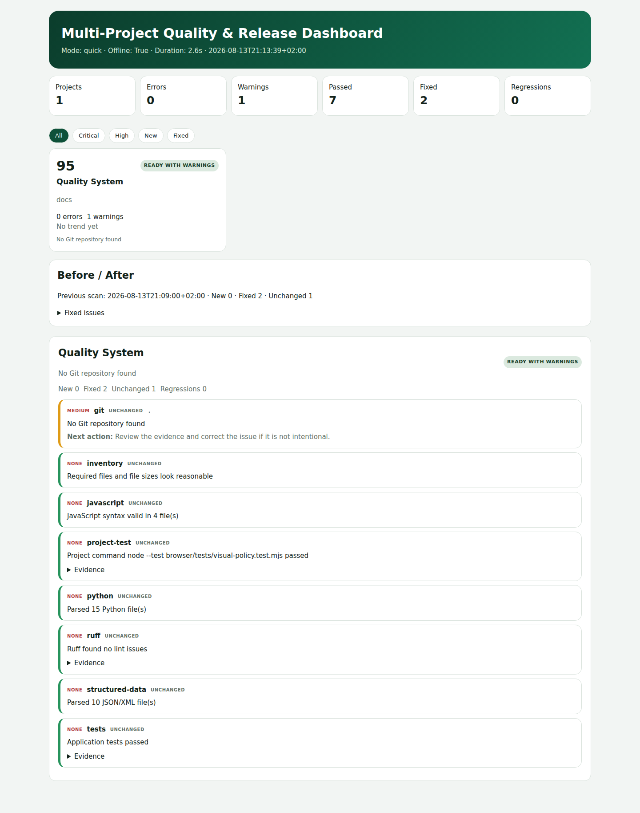

# Project Quality & Release Inspector

**Konfigurationsgesteuerte Multi-Projekt-Plattform für Qualitätsprüfung, Regressionserkennung und Release-Entscheidungen.**

Das System prüft statische Websites, JavaScript-Dashboards, Flask-/Python-Anwendungen und Dokumentationsprojekte über einen gemeinsamen Workflow. Neue Projekte werden über JSON-Konfiguration ergänzt; der Inspector verändert den geprüften Quellcode nicht.

> inspect → detect → compare → prioritize → report → release decision



## Welches Problem löst das Projekt?

Mit wachsender Projektzahl werden manuelle Kontrollen von Links, Mobilansicht, Tests, SEO, Accessibility, Abhängigkeiten und Codequalität langsam und fehleranfällig. Der Inspector bündelt bestehende, bewährte Werkzeuge in einem reproduzierbaren lokalen Workflow und beantwortet pro Projekt:

- Was ist seit dem letzten Scan neu, behoben oder unverändert?
- Welche Probleme sind wirklich release-blockierend?
- Ist das Projekt **READY**, **READY WITH WARNINGS** oder **NOT READY**?
- Wie entwickeln sich Fehler, Warnungen, Health Score und Lighthouse-Werte?

## Funktionsumfang

- Datei-Inventar, Git-Hygiene und Secret-Erkennung
- HTML-Links, Assets, IDs, Bildbeschreibungen, strukturierte Daten und sichtbare `.html`-URLs
- SEO, robots.txt, sitemap.xml, Open Graph und Analytics-Consent-Hinweise
- Python AST, Ruff, Bandit, Radon, Vulture und pip-audit
- JavaScript-Syntax, projektinterne Tests und Validierungsbefehle
- Playwright für Desktop-, Tablet- und Mobilansichten
- Browser-Kompatibilitäts-Smoke-Tests in Chromium, Firefox und WebKit
- realistische Full-Page-Screenshots nach schrittweisem Scrollen, damit auch Lazy-Load-Bilder geprüft werden
- Explizite Theme-Policies (`automatic`, `manual`, `fixed-dark`, `fixed-light`) statt einer pauschalen Dark-Mode-Annahme
- Browser-Verhaltensprüfung für automatische und feste Themes, dunkle Innenflächen, mobile Menüs, KPI-Grids und bündige Sticky-Header
- Manifest-Prüfung für Projektpfade, tatsächlich vorhandene Icons und deklarierte Bildgrößen
- axe-core für automatisierte WCAG-Prüfungen
- Browserprüfung für ausdrücklich einzeilig markierte Überschriften (`.single-line-heading`)
- Lighthouse für Performance, Accessibility, Best Practices und SEO
- WSL-sichere temporäre Chromium-Profile mit garantiertem Cleanup nach jedem Lighthouse-Lauf
- visuelle Regressionen mit ausdrücklich freigegebenen Screenshot-Baselines
- Scan-Historie, Before/After-Vergleich und Trenddaten
- konfigurierbare Prioritäten und Release-Regeln
- HTML-, JSON- und kompakte machine-readable Summary
- optionaler GitHub-Actions-/CI-Modus
- Audit von cron, user-systemd, Publish-Skripten und GitHub-Actions-Workflows
- Generator-Verträge, die eine Rückkehr ausgemusterter Domains nach einem Rebuild verhindern
- begrenzte Live-Prüfung externer Links mit transparenter Behandlung von Bot-Sperren

## Architektur

```text
Project config
    ↓
Profile + optional adapter
    ↓
Check pipeline (quick / full)
    ↓
Policy: priority + next action + release rules
    ↓
History comparison
    ↓
HTML dashboard + JSON + summary
```

Die vorhandenen Checker bleiben voneinander getrennt:

- `quality_system/checks.py` — statische, Python-, Git-, SEO- und Dependency-Prüfungen
- `quality_system/checks_operations.py` — Automation, Workflows, Generator-Verträge und externe Links
- `quality_system/runner.py` — lokale Server, Browser, Lighthouse und Adapter
- `quality_system/policy.py` — Priorität, Health Score und Release Verdict
- `quality_system/history.py` — Scan-Historie und Before/After
- `quality_system/report.py` — Dashboard und maschinenlesbare Reports
- `quality_system/adapters/` — optionale projektspezifische Erweiterungen

## Unterstützte Profile

| Profil | Typischer Einsatz |
|---|---|
| `static_website` | Portfolio, Landingpage, redaktionelle Website |
| `flask_web_app` | serverseitige Python-/Flask-Anwendung |
| `javascript_dashboard` | interaktives JavaScript-/BI-Dashboard |
| `python_automation` | Automation, Datenpipeline oder CLI |
| `documentation` | README-, Wissens- oder lokales Dokumentationsprojekt |
| `custom` | Grundlage für einen kleinen optionalen Adapter |

Die Profile liegen in `config/profiles.json`. Ein bekanntes Profil erfordert keine Änderung am Core-Code.

## Installation

Voraussetzungen: Python 3.12+, npm und Internet für die Erstinstallation. Das Setup installiert eine projektgebundene Node-22-Laufzeit; Browser- und Lighthouse-Prüfungen verwenden bewusst diese Version statt einer möglicherweise älteren Systemversion.

```bash
git clone <repository-url>
cd quality-system
bash scripts/setup.sh
```

Die Prüfungen laufen danach überwiegend lokal. Nur Live-URL-Prüfung, Vulnerability-Datenbank und gegebenenfalls externe Seitenressourcen benötigen Internet.

## Verwendung

Täglicher schneller Scan:

```bash
bash scripts/run_quick.sh
```

Komplett offline:

```bash
bash scripts/run_quick.sh --offline
```

Vollständiger Release-Scan:

```bash
bash scripts/run_full.sh
```

Ein einzelnes Projekt:

```bash
bash scripts/run_quick.sh --project company-site
bash scripts/run_full.sh --project crm
```

Verfügbare Projekte:

```bash
.venv/bin/python -m quality_system --list-projects
```

Eigenen Config-Pfad verwenden:

```bash
bash scripts/run_quick.sh --config config/projects.local.json
```

## Ein neues Projekt hinzufügen

1. `config/projects.example.json` nach `config/projects.local.json` kopieren.
2. Einen Eintrag ergänzen.
3. Profil, Pfad, Routen und projektspezifische Befehle angeben.
4. Scan starten.

Minimalbeispiel:

```json
{
  "id": "company-site",
  "name": "Company Website",
  "path": "../company-site",
  "profile": "static_website",
  "live_url": "https://example.com/",
  "browser_paths": ["/", "/contact/"],
  "visual_paths": ["/"],
  "lighthouse_path": "/",
  "required_files": ["index.html", "robots.txt", "sitemap.xml"]
}
```

Konfigurierbar sind unter anderem:

- Start- und Testbefehle
- öffentliche URL und Browser-Routen
- erwartete Theme-Policy: `automatic`, `manual`, `fixed-dark` oder `fixed-light`
- aktivierte Checker
- Viewports und ignorierte Dateien/Routen
- Firefox-/WebKit-Smoke-Routen (`cross_browser_paths`)
- Publish-/Workflow-Dateien (`automation_paths`) und ausgemusterte Domains (`forbidden_strings`)
- nicht mutierende Generator-Probes (`generator_contracts`)
- maximale Zahl externer Links pro Projekt (`external_link_limit`)
- projektspezifische Validierungsbefehle
- Prioritäts-Overrides und Release-Regeln

Der 10., 19. oder 30. Eintrag verwendet denselben Core. Nur wenn ein Projekt eine fachlich einzigartige Prüfung benötigt, wird eine kleine Datei in `quality_system/adapters/` ergänzt und im Projekt mit `"adapter": "name"` aktiviert.

Ein Prüfergebnis formuliert nur die tatsächlich belegte Evidenz. Ein vorhandener Quellcode-Marker beweist beispielsweise noch keine funktionierende Browser-Interaktion: Source-Verträge, Konfigurationsabgleich und gerendertes Verhalten werden deshalb getrennt ausgewiesen.

## Quick und Full

**Quick** ist für die tägliche Arbeit gedacht: Kernprüfungen, Projekt-Tests und Browserkontrolle in zwei Viewports.

**Full** ergänzt tiefere Security-/Maintainability-Checks, Duplikationsanalyse, vier Chromium-Viewports, Firefox-/WebKit-Smoke-Tests, externe Live-Links, lokale Automation und Lighthouse. Full ist für eine Release- oder Publish-Entscheidung gedacht.

## Automation und Generator-Sicherheit

`automation_paths` prüft Publish-Skripte und Workflow-Dateien auf ausgemusterte Domains. GitHub-Actions-YAML wird geparst; externe Actions benötigen eine explizite Version.

`generator_contracts` startet ausschließlich konfigurierte, nicht mutierende Renderer-Probes. Der Output muss die freigegebene Domain enthalten und darf keine alte Domain zurückbringen. Dadurch wird nicht nur der aktuelle HTML-Stand geprüft, sondern auch die Quelle, die ihn beim nächsten automatischen Lauf neu erzeugt.

Lokale cron-/systemd-Erwartungen stehen in `config/operations.local.json` und werden nicht veröffentlicht. Als Vorlage dient `config/operations.example.json`.

## Browser-Abdeckung

Chromium führt die vollständige Layout-, Accessibility-, Interaktions- und visuelle Prüfung aus. Im Full-Modus prüfen Firefox und WebKit zusätzlich Startseiten in Desktop- und Mobilbreite auf Ladefehler, Überlauf, defekte Bilder, JavaScript-Fehler und mobile Navigation.

Das Setup installiert alle drei Browser. Unter Linux/WSL können WebKit-Systembibliotheken einmalig Administratorrechte erfordern:

```bash
sudo env PATH="$PWD/node_modules/node/bin:$PATH" npx playwright install-deps firefox webkit
```

## Visual Baselines

Eine Baseline ist ein ausdrücklich freigegebener Referenz-Screenshot. Fehlende Baselines werden niemals automatisch erstellt.

```bash
bash scripts/run_full.sh --project company-site --update-baselines
```

Diesen Befehl nur nach visueller Kontrolle verwenden. Ein normaler Scan darf eine Referenz nicht überschreiben.

## Priorität und Release Readiness

Findings behalten ihren technischen Status `error / warning / info / pass` und erhalten zusätzlich:

- **Critical** — sofort prüfen; blockiert standardmäßig
- **High** — schweres Funktions-, Security- oder Responsive-Problem
- **Medium** — wichtig, aber nicht immer release-blockierend
- **Low** — Maintainability oder Verbesserung
- **Info** — Hinweis ohne Handlungsdruck

Standardentscheidung:

- **NOT READY** — Critical-Finding oder release-blockierender High-Error
- **READY WITH WARNINGS** — keine Blocker, aber offene Hinweise
- **READY** — keine offenen Errors oder Warnings

Der Report nennt den konkreten Grund und die empfohlene nächste Aktion. Regeln können global oder pro Projekt überschrieben werden.

## Reports und Historie

Nach einem Scan:

```text
reports/latest.html
reports/latest.json
reports/latest-summary.json
history/scans/
history/index.json
```

Das HTML-Dashboard zeigt Projektkarten, Health Score, Verdict, wichtigste Probleme, Filter sowie New/Fixed/Unchanged/Regression. Die Historie ist bewusst als leichtgewichtige JSON-Struktur umgesetzt; eine Datenbank ist derzeit nicht erforderlich.

## CI / GitHub Actions

`.github/workflows/quality.yml` führt die Selbsttests aus. Wenn `config/projects.ci.json` vorhanden ist, startet zusätzlich ein Projekt-Scan:

```bash
.venv/bin/python -m quality_system --mode quick --offline --ci --config config/projects.ci.json
```

Warnings stoppen die Pipeline nicht. Der Prozess endet nur bei **NOT READY** mit Exit Code 1. Ein Konfigurations- oder Programmfehler verwendet Exit Code 2.

## Selbstprüfung

```bash
.venv/bin/python -m pytest -q
node --test browser/tests/*.test.mjs
.venv/bin/ruff check quality_system tests
```

Getestet werden unter anderem Config/Profile-Auflösung, Secret Detection, Offline-Verhalten, Release Policy, Exit Codes, History Comparison, Report-Erzeugung, Automation-/Workflow-Erkennung, Generator-Domain-Verträge, externe Linkfehler und die Regel, dass Baselines nur nach expliziter Freigabe aktualisiert werden.

## Datenschutz und öffentliche Version

Generierte Reports, Screenshots, Scan-Historie, lokale Konfiguration, virtuelle Umgebungen und Browser-Profile sind per `.gitignore` ausgeschlossen. Die öffentliche Konfiguration enthält nur neutrale Beispiele und keine absoluten lokalen Pfade, Secrets oder privaten Projektdaten.

## Grenzen

- Automatisierte Tests ersetzen keine fachliche Produktprüfung.
- Axe und Lighthouse finden nicht jedes UX- oder Accessibility-Problem.
- Eine visuelle Änderung kann beabsichtigt sein und muss von einem Menschen bewertet werden.
- Der Inspector nimmt bewusst keine automatischen Änderungen an geprüften Projekten vor.
- Spezifische Login-/Startabläufe müssen konfiguriert oder über einen kleinen Adapter ergänzt werden.
- Externe Websites können automatisierte Linkprüfungen mit 401, 403 oder 429 blockieren; das wird als nicht verifizierbarer Hinweis statt als bewiesener Defekt ausgewiesen.

## Portfolio-Einordnung

**Project title:** Project Quality & Release Inspector

**Subtitle:** Config-driven multi-project validation with history, regression detection and release decisions

**Short GitHub description:** Config-driven multi-project quality and release validation with Playwright, Lighthouse, Ruff, pytest, scan history and release verdicts.

**Portfolio-Beschreibung:**

> Konfigurationsgesteuerte QA-Plattform für mehrere Websites und Python-Anwendungen. Sie kombiniert Code-, Browser-, SEO-, Accessibility- und Security-Prüfungen, vergleicht Scans und erstellt nachvollziehbare Release-Entscheidungen, ohne den geprüften Quellcode zu verändern.

Empfohlener Demo-Ablauf:

1. Projektübersicht und Health Scores zeigen.
2. Ein NOT-READY-Projekt öffnen und den Blocker erklären.
3. Before/After mit einem behobenen und einem neuen Finding zeigen.
4. Responsive-Screenshot und Lighthouse-Trend öffnen.
5. Einen neuen Projekt-Eintrag nur per JSON-Konfiguration ergänzen.
